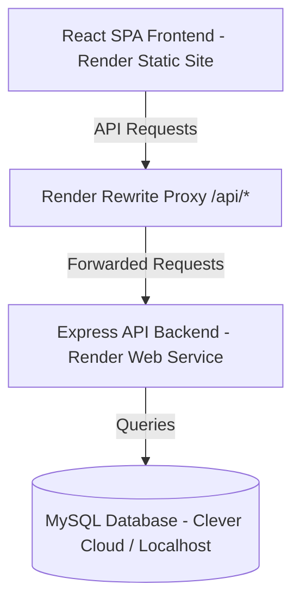

# Codebase Documentation: Biller POS Application

This document provides a complete overview of the current system architecture, directory structure, data schemas, and page-by-page file responsibilities for the Biller POS application.

---

## 1. System Architecture & Tech Stack

The application is structured as a decoupled monorepo containing a Node.js Express backend and a React Vite frontend.



### Core Technologies
*   **Frontend**: React 19, Vite, TypeScript, React Router DOM 7.
*   **Backend**: Node.js, Express, MySQL2 (Promises wrapper), dotenv.
*   **Database**: MySQL (hosted on Clever Cloud for production, running locally on `localhost` for development).
*   **Styling**: Vanilla CSS (modular component-level stylesheets) with a modern, responsive light-lavender aesthetic.
*   **Deployment**: Render (Static Site for frontend, Web Service for API).

---

## 2. Directory Structure

```text
Billing/
├── backend/
│   ├── .env                    # Environment settings (DB Host, Port, Password)
│   ├── db.js                   # MySQL database pool creation
│   ├── init-db.js              # Database table initializer script
│   ├── package.json            # Node dependencies
│   ├── schema.sql              # Database table definitions
│   └── server.js               # Express server routing & API endpoints
├── frontend/
│   ├── public/
│   │   ├── favicon.svg         # Brand symbol logo SVG
│   │   └── login_bg.png        # Authentication background image
│   ├── src/
│   │   ├── pages/
│   │   │   ├── LoginPage/
│   │   │   │   ├── components/
│   │   │   │   │   ├── LoginForm.tsx
│   │   │   │   │   ├── LoginForm.css
│   │   │   │   │   ├── RegisterForm.tsx
│   │   │   │   │   └── RegisterForm.css
│   │   │   │   ├── Login.tsx
│   │   │   │   └── Login.css
│   │   │   ├── OnboardingPage/
│   │   │   │   ├── Onboarding.tsx
│   │   │   │   └── Onboarding.css
│   │   │   └── InventoryPage/
│   │   │       ├── Inventory.tsx
│   │   │       └── Inventory.css
│   │   ├── App.tsx             # React Router routing configurations
│   │   ├── main.tsx            # React root mount point
│   │   └── index.css           # Global typography & root resets
│   ├── package.json            # Frontend packages & scripts
│   ├── tsconfig.json           # TS configurations
│   └── vite.config.ts          # Vite server proxy configs
└── codebase_documentation.md   # System documentation
```

---

## 3. Database Schema

The tables are configured in [backend/schema.sql](file:///d:/all%20projects/Billing/backend/schema.sql):

### 1. `users` Table
Stores user credentials and roles (uses SHA-256 for password security).
*   `id` (INT, Primary Key, Auto-increment)
*   `phone_number` (VARCHAR, Unique, Not Null)
*   `username` (VARCHAR)
*   `password` (VARCHAR)
*   `role` (ENUM: 'Owner', 'Secondary Admin', 'Biller'; default 'Biller')
*   `created_at` (TIMESTAMP)

### 2. `business_profile` Table
Stores information about the physical business outlet.
*   `id` (INT, Primary Key, Auto-increment)
*   `owner_id` (INT, Foreign Key referencing `users(id)`)
*   `business_name` (VARCHAR, Not Null)
*   `phone_number` (VARCHAR)
*   `outlet_address` (TEXT)
*   `upi_id` (VARCHAR)
*   `fssai_number` (VARCHAR)
*   `tax_slab` (DECIMAL)
*   `seating_capacity` (INT)
*   `business_type` (VARCHAR)
*   `business_category` (VARCHAR)
*   `gstin` (VARCHAR)
*   `footer_message` (TEXT)

### 3. `items` Table
Stores product inventory catalog details.
*   `id` (INT, Primary Key, Auto-increment)
*   `business_id` (INT, Foreign Key referencing `business_profile(id)`)
*   `category_id` (INT, Nullable, Foreign Key)
*   `name` (VARCHAR, Not Null)
*   `image_url` (VARCHAR)
*   `sales_price` (DECIMAL, Not Null)
*   `tax_percentage` (DECIMAL, default 0.00)
*   `price_includes_tax` (BOOLEAN, default false)
*   `current_stock` (INT, default 0)
*   `is_favorite` (BOOLEAN, default false)

---

## 4. File-by-File Details

### Backend Configuration & Endpoints

#### [db.js](file:///d:/all%20projects/Billing/backend/db.js)
Sets up a connection pool using `mysql2/promise` using environment variables. This pool is reused across requests for database queries.

#### [init-db.js](file:///d:/all%20projects/Billing/backend/init-db.js)
Database initializer script. It reads the local environment `DB_NAME` database settings, connects to the server, parses [schema.sql](file:///d:/all%20projects/Billing/backend/schema.sql) and builds the database tables if they do not exist.

#### [server.js](file:///d:/all%20projects/Billing/backend/server.js)
Defines Express server routes:
*   `POST /api/auth/register`: Hashes password using SHA-256 and inserts user. Returns user object.
*   `POST /api/auth/login`: Checks username password hashes and returns user details.
*   `GET /api/business/:userId`: Checks if a user has configured an onboarding business profile.
*   `POST /api/business`: Creates a new store business profile.
*   `GET /api/items/:businessId`: Fetches all inventory items belonging to a store.
*   `POST /api/items`: Inserts a new catalog item.

---

### Frontend Pages & Styling

#### [App.tsx](file:///d:/all%20projects/Billing/frontend/src/App.tsx)
Sets up paths for the client application:
*   `/`: Redirects to `/login`.
*   `/login`: Renders the unified login/signup container.
*   `/onboarding`: Renders the mobile-first store wizard.
*   `/inventory`: Renders the inventory item catalog.

#### [Login.tsx](file:///d:/all%20projects/Billing/frontend/src/pages/LoginPage/Login.tsx) & [Login.css](file:///d:/all%20projects/Billing/frontend/src/pages/LoginPage/Login.css)
Authenticating viewport wrapper. Aligns the active auth sub-form (`LoginForm` or `RegisterForm`) to the absolute center of a soft gray-blue page background (`#f8fafc`).

#### [LoginForm.tsx](file:///d:/all%20projects/Billing/frontend/src/pages/LoginPage/components/LoginForm.tsx) & [LoginForm.css](file:///d:/all%20projects/Billing/frontend/src/pages/LoginPage/components/LoginForm.css)
*   **UI**: Renders a top dark-navy logo badge loaded with `/favicon.svg`, bold titles, input fields with inline SVG icons (Phone and Lock), a "Forgot Password?" label link, a password-visibility toggle, and a solid blue submit button (`#0258d4`).
*   **Logic**: Sends credentials payload to `/api/auth/login`. Sets `session_user` in `localStorage`, queries `/api/business/:userId` to verify store setup, and routes to `/inventory` or `/onboarding` accordingly.

#### [RegisterForm.tsx](file:///d:/all%20projects/Billing/frontend/src/pages/LoginPage/components/RegisterForm.tsx) & [RegisterForm.css](file:///d:/all%20projects/Billing/frontend/src/pages/LoginPage/components/RegisterForm.css)
*   **UI**: Collects Owner Full Name, Phone Number, Password, and Confirm Password. Inputs contain inline left SVG icons (user, phone, lock, loop) and password-visibility eye toggle switches. Action button submits with a right arrow icon (`Register →`).
*   **Logic**: Validates parameters and submits payload to `/api/auth/register`, setting `session_user` and routing to onboarding.

#### [Onboarding.tsx](file:///d:/all%20projects/Billing/frontend/src/pages/OnboardingPage/Onboarding.tsx) & [Onboarding.css](file:///d:/all%20projects/Billing/frontend/src/pages/OnboardingPage/Onboarding.css)
*   **UI**: A full-height (`100dvh`) wizard layout containing a back button header, a 2-step stepper progress tracker (`Details` $\rightarrow$ `Contact`), and rounded light-lavender inputs (`#f5f3ff`).
    *   *Step 1 (Details)*: Inputs for Business Name and Business Type (Retail, Restaurant, or Service select).
    *   *Step 2 (Contact)*: Inputs for Phone Number (+91 prefix) and Outlet Address.
*   **Logic**: Checks user authorization on load. On final submission, sends profile data to `POST /api/business` and saves configuration to `session_business` in `localStorage`.

#### [Inventory.tsx](file:///d:/all%20projects/Billing/frontend/src/pages/InventoryPage/Inventory.tsx) & [Inventory.css](file:///d:/all%20projects/Billing/frontend/src/pages/InventoryPage/Inventory.css)
*   **UI**: Header panel with custom logout option and catalog action buttons.
    *   *Catalog List*: Scrollable grid/list displaying item names, prices, tax rate tags, and stock counts.
    *   *Empty State*: Placeholder illustration box showing up if the catalog is empty.
    *   *Add Modal*: Slide-up overlay card sheet collecting Product Name, Price, and GST Slab.
*   **Logic**: Loads products on load via `GET /api/items/:businessId`. Inserts products using `POST /api/items` and updates the catalog dashboard.

---

## 5. Main Application Flows

### 1. First-Time Registration & Onboarding Flow
1.  **User registers** in `RegisterForm.tsx` $\rightarrow$ `POST /api/auth/register` is called.
2.  User profile is returned, and app redirects to `/onboarding`.
3.  User enters **Business Name** & **Type** $\rightarrow$ Clicks **Next** (Step 1).
4.  User enters **Phone** & **Address** $\rightarrow$ Clicks **Complete Setup** (Step 2).
5.  Onboarding API inserts profile data to `business_profile`. Business details are saved locally, and router navigates to `/inventory`.
6.  The `Inventory` catalog page displays the empty placeholder, inviting the user to click **Add Your First Item** to begin populating their store database.

### 2. Returning User Flow
1.  **User logs in** in `LoginForm.tsx` $\rightarrow$ `POST /api/auth/login` checks credentials.
2.  Backend reports authentication success and returns user details.
3.  Frontend checks database for business profile (`GET /api/business/:userId`).
4.  Since they are a returning user, profile is found. The router skips onboarding and navigates straight to `/inventory`.
5.  `Inventory` catalog loads previously created items (`GET /api/items/:businessId`) and displays them inside the item list.
